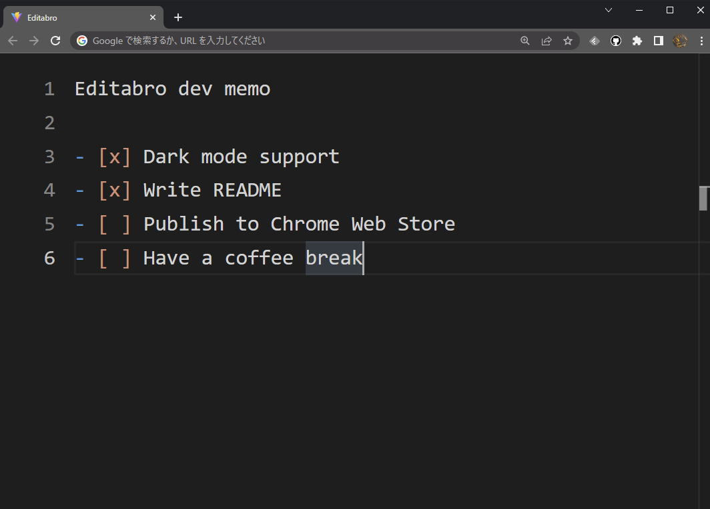

# Editabro

Editor in new tab.


## Features

Editabro is a browser extension to change the new tab page to an editor.

- No file
- No config
- Persisted in browser
- Dark mode support
- Markdown highlighting
- VSCode derived features



## Usage

### Installation

~Install from Chrome Web Store.~

This extension is not yet released on Chrome Web Store.
Manually build the extension and install it according to the Development section.

### Supported browsers

Now only Chrome is supported, but pull requests are welcome for other browsers.

## Development

### Setup

This extension is built with TypeScript, Vite, and so on.
Install dependencies with:

```
npm install
```

### Build for development

Build the extension to `./dist/` directory for development use (e.g. with HMR).

```
npm run dev
```

Then load `./dist/` directory as an extension from extensions settings page in your browser.
You may need to enable development mode to do this operation.

### Build for production

```
npm run build
```

### Other information

There are no strict restrictions on Node.js version or other dependencies,
but I'm developing in the following environment with WSL2:

```console
$ node -v
v18.0.0
$ npm -v
8.6.0
$ grep PRETTY_NAME /etc/os-release
PRETTY_NAME="Ubuntu 20.04.1 LTS"
```
