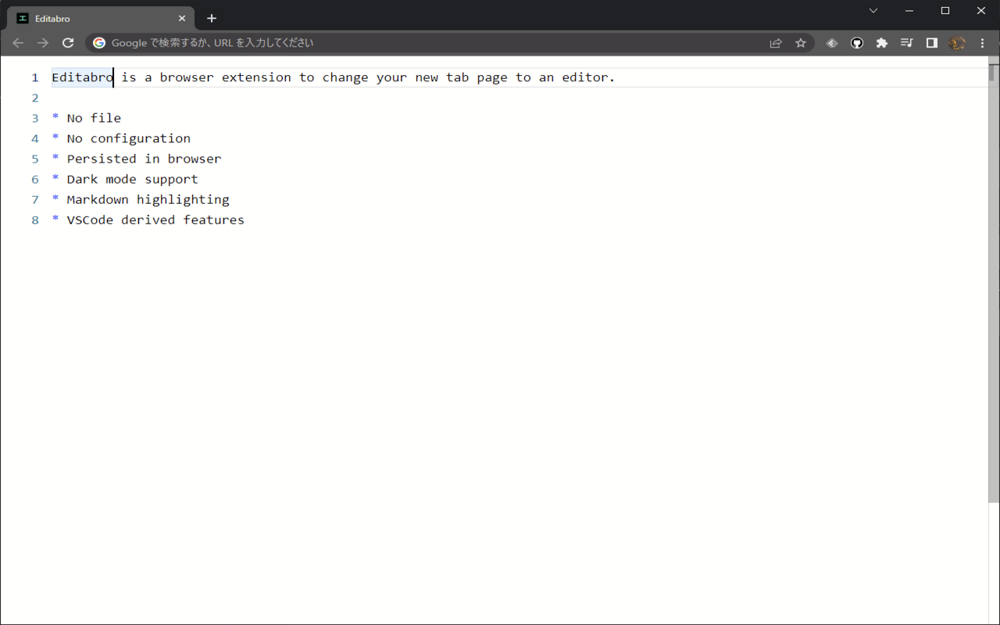

# Editabro

Editor in new tab.


## Features

Editabro is a browser extension to change the new tab page to an editor.

- No file
- No config
- Auto-save in browser
- Sync within chrome account
- Dark mode support
- Markdown support



## Usage

### Installation

Install from Chrome Web Store:

- <https://chrome.google.com/webstore/detail/editabro/eodgdnjgkjjlohklhoaapfhghgcoihmf>

### Command palette

There are a lot of VSCode derived features.
Press <kbd>F1</kbd> to open the command palette, then search commands and their shortcut keys.


### Supported browsers

Now only Chrome is supported, but pull requests are welcome for other browsers.

## Development

### Setup

This extension is built with TypeScript, Vite, and so on.
Install dependencies with:

```
npm install
```

### Build for development

Build the extension to `./dist/` directory for development use (e.g. with HMR).

```
npm run dev
```

Then load `./dist/` directory as an extension from extensions settings page in your browser.
You may need to enable development mode to do this operation.

### Build for production

```
npm run build
```

### Other information

There are no strict restrictions on Node.js version or other dependencies,
but I'm developing in the following environment with WSL2:

```console
$ node -v
v20.12.2
$ npm -v
10.5.0
$ grep PRETTY_NAME /etc/os-release
PRETTY_NAME="Ubuntu 22.04.4 LTS"
```
